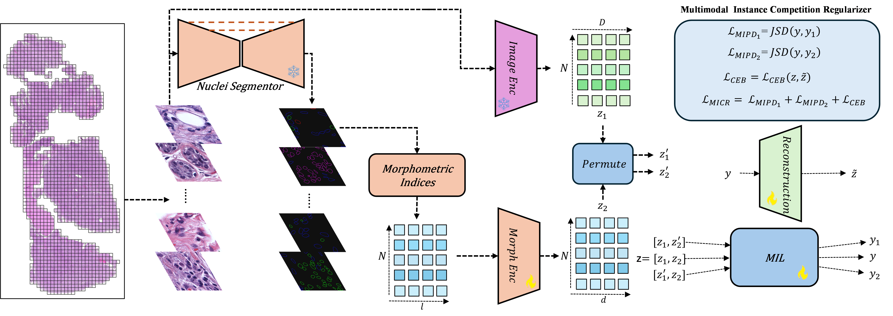

# Coupled Histology and Morphometric Representations Improve Multiple Instance Learning for Tumor Classification


This repository presents a multimodal multiple-instance learning (MIL) framework for histopathology whole-slide image (WSI) classification. The method combines high-level image patch embeddings with cell/nuclei-derived morphometric representations, including intensity- and geometry-based feature groups, extracted through a plug-and-play nuclei segmentation and typing module.

To better integrate heterogeneous modalities, we introduce the **Multimodal Instance Competition Regularizer (MICR)**, a training objective designed to reduce modality dominance and encourage both image and morphometric branches to explore task-relevant evidence during learning. This helps mitigate premature convergence to a single strong modality and improves robustness.

The framework also incorporates instance-level and feature-space permutation strategies to improve generalization under heterogeneous tissue patterns. We evaluate the proposed method on three public benchmarks—**TCGA-BRCA**, **TCGA-LUNG (LUAD/LUSC)**, and **CAMELYON16**—and demonstrate improved performance over conventional MIL baselines.



**Figure:** Overview of the proposed MorphMIL pipeline.

## Environment Setup

Create and activate a Python virtual environment, then install the required packages:

```bash
python3.10 -m venv morph_env
source morph_env/bin/activate
pip install -r requirements.txt
```

## Dataset Preprocessing

We preprocess the datasets **TCGA-BRCA**, **TCGA-LUNG**, and **CAMELYON16** following the data preparation pipeline provided by the [CLAM repository](https://github.com/mahmoodlab/CLAM).

Please refer to the original CLAM repository for details on:
- whole-slide image patch extraction,
- feature extraction,
- and dataset organization.

### Create patch coordinates:

```bash
python create_patches_fp.py \
  --source ./DATASET/raw \
  --save_dir ./DATASET/preprocess \
  --patch_size 256 \
  --seg \
  --patch \
  --stitch \
  --process_list ./DATASET/preprocess/process_list.csv \
  --patch_level 1
```

### Extract image patch features:
```bash
CUDA_VISIBLE_DEVICES=0 python extract_features_fp.py \
  --data_h5_dir ./DATASET/preprocess \
  --data_slide_dir ./DATASET/raw \
  --csv_path ./DATASET/preprocess/process_list_autogen.csv \
  --feat_dir ./DATASET/encoded_features \
  --model_name resnet50_trunc \
  --batch_size 724 \
  --target_patch_size 224 \
  --slide_ext .svs
```

### Extract morphometric features:
```bash
CUDA_VISIBLE_DEVICES=0 python extract_morphometric_features_clean.py \
  --data_h5_dir ./DATASET/preprocess \
  --data_slide_dir ./DATASET/raw \
  --csv_path ./DATASET/preprocess/process_list_autogen.csv \
  --feat_dir ./DATASET/encoded_morphometrics \
  --model_name CellViTSAM \
  --model_checkpoints ./checkpoints/CellViT-SAM-H-x40-AMP-002.pth \
  --batch_size 24 \
  --target_patch_size 256 \
  --slide_ext .svs
```


## Training:

The training hyperparameters are defined in:
```bash
./src/trainMorphMIL.yaml
```
To train the proposed MorphMIL model, run:

```bash
python3 ./src/trainMorphMIL.py
```

## Test and loading checkpoints:

coming soon. 